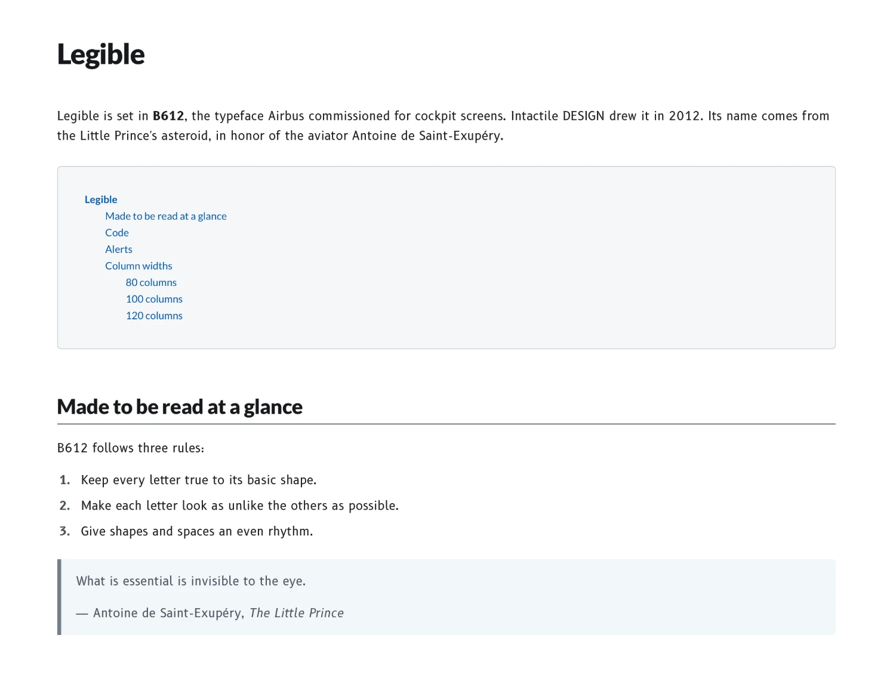

# Legible

A high-contrast theme for [Typora](https://typora.io), in light and dark, set in the
typeface Airbus made for cockpit screens.

**[See it live ›](https://baw-dev.github.io/legible-typora-theme/)** The sample page,
exported from Typora, in the theme's own fonts, with a switch for Legible Dark.

<picture>
  <source media="(prefers-color-scheme: dark)" srcset="screenshots/dark.png">
  
</picture>

## Why B612

In 2010, Airbus teamed up with ENAC and the Université de Toulouse III to define a
typeface for cockpit screens: easier to read, more comfortable, consistent across the
cockpit. Two years later, Intactile DESIGN drew its eight styles. Every letter keeps
its basic shape yet looks as unlike the others as possible, so none can be mistaken
for another.

[B612](https://github.com/polarsys/b612) takes its name from the Little Prince's
asteroid, a tribute to the pilot and author Antoine de Saint-Exupéry.

> Perfection is achieved, not when there is nothing more to add, but when there is
> nothing left to take away.
>
> — Antoine de Saint-Exupéry, writing about aircraft design in *Wind, Sand and Stars*

Legible ships all eight styles, with [Lato](https://www.latofonts.com) for headings.

## Install

1. [Download Legible](https://github.com/baw-dev/legible-typora-theme/archive/refs/heads/main.zip) and unzip it.
2. In Typora, choose **Preferences › Appearance › Open Theme Folder**.
3. Copy `legible.css`, `legible-dark.css` and the `legible` folder there.
4. Restart Typora, then choose **Themes › Legible** or **Legible Dark**.

The fonts come with the theme. Tested with Typora 1.12 on macOS.

## Room for code

Code blocks fit 80 columns. Wider windows fit 100 columns (from 1400 px) and 120
(from 1800 px), and tables widen with them. Box-drawing and block characters stay
on the grid. PDFs print on white, with 80-column code on A4 and Letter.

Typora won't send a dark theme to the printer, so from Legible Dark choose
**Export to PDF**, which comes out the same as Legible.

Open `sample.md` to see every element, or [see it live](https://baw-dev.github.io/legible-typora-theme/).

## Accessibility

Legible is built to [WCAG 2.2](https://www.w3.org/TR/WCAG22/), the standard behind Section 508 and
EN 301 549: every text color meets AAA contrast (7:1), borders and focus rings meet 3:1, and nothing
is lost when you enlarge text or spacing. Its spacing follows ISO 9241-110's call for a consistent,
predictable layout.

## License

The theme is [MIT](LICENSE). B612 and Lato are under the
[SIL Open Font License](legible/).
