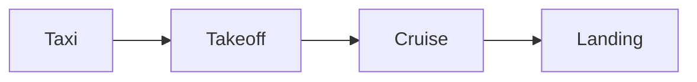

# Legible

Legible is set in **B612**, the typeface Airbus commissioned for cockpit screens. Intactile DESIGN drew it in 2012. Its name comes from the Little Prince's asteroid, in honor of the aviator Antoine de Saint-Exupéry.

[toc]

## Made to be read at a glance

B612 follows three rules:

1. Keep every letter true to its basic shape.
2. Make each letter look as unlike the others as possible.
3. Give shapes and spaces an even rhythm.

> What is essential is invisible to the eye.
>
> — Antoine de Saint-Exupéry, *The Little Prince*

Text can be **bold**, *italic*, <mark>highlighted</mark>, `code` or a [link](https://github.com/polarsys/b612). Press <kbd>Ctrl</kbd> <kbd>/</kbd> (<kbd>⌘</kbd> <kbd>/</kbd> on a Mac) to see this page as markdown.

- [x] Light theme
- [x] Dark theme
- [ ] Your next document

## Code

```python
KNOT_IN_KMH = 1.852  # exact, by definition


def to_kmh(knots: float) -> float:
    """Convert an airspeed in knots to kilometers per hour."""
    return round(knots * KNOT_IN_KMH, 1)


print(to_kmh(250))  # 463.0
```

$$
\text{km/h} = \text{knots} \times 1.852
$$



## Alerts

> [!NOTE]
> The fonts come with the theme. There is nothing else to install.

> [!TIP]
> Wider windows fit longer lines of code.

> [!IMPORTANT]
> Copy the `legible` folder along with both CSS files.

> [!WARNING]
> Typora lists new themes only after a restart.

> [!CAUTION]
> Renaming the `legible` folder breaks the fonts.

## Column widths

Code blocks fit 80 columns. Windows 1400 px and wider fit 100, and 1800 px and wider fit 120. Each ruler stays on one line once the window is wide enough.

### 80 columns

```text
         1         2         3         4         5         6         7         8
12345678901234567890123456789012345678901234567890123456789012345678901234567890
```

### 100 columns

```text
         1         2         3         4         5         6         7         8         9        10
1234567890123456789012345678901234567890123456789012345678901234567890123456789012345678901234567890
```

### 120 columns

```text
         1         2         3         4         5         6         7         8         9        10        11        12
123456789012345678901234567890123456789012345678901234567890123456789012345678901234567890123456789012345678901234567890
```

| Convention                 | Limit | Fits on screen   | Fits in an A4 PDF |
| -------------------------- | ----- | ---------------- | ----------------- |
| PEP 8 (Python)             | 79    | Every width      | Yes               |
| Prettier default           | 80    | Every width      | Yes               |
| markdownlint MD013 default | 80    | Every width      | Yes               |
| Black (Python)             | 88    | 1400px and wider | No                |
| rustfmt default            | 100   | 1400px and wider | No                |
| Google Java Style          | 100   | 1400px and wider | No                |
| JetBrains IDEs hard wrap   | 120   | 1800px and wider | No                |

B612 and Lato are free fonts.[^ofl]

[^ofl]: Both are under the SIL Open Font License. The license texts are in the `legible` folder.
